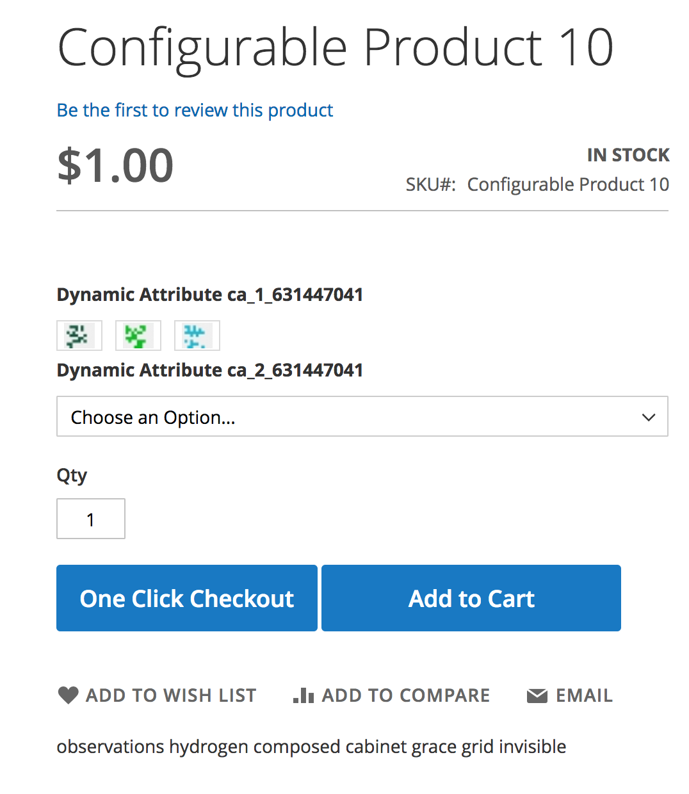
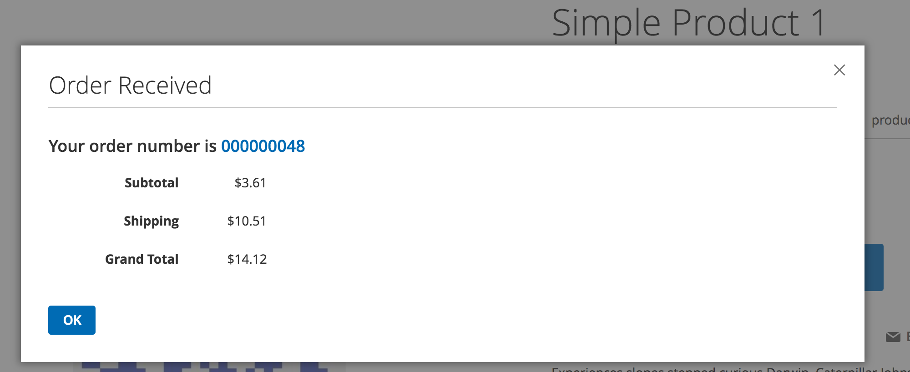
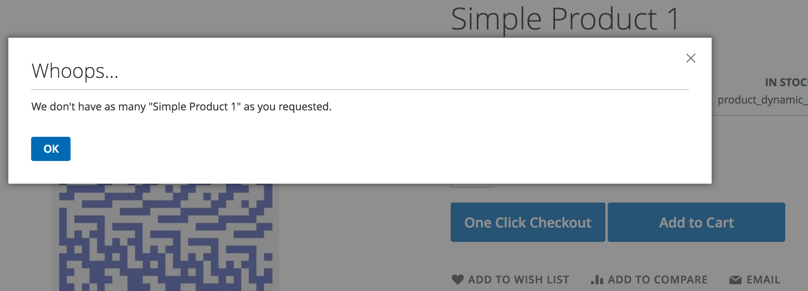
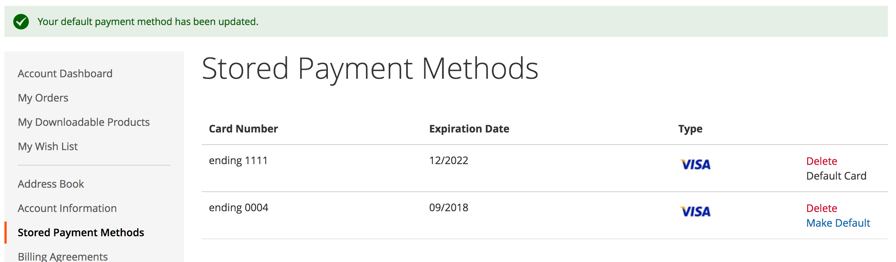
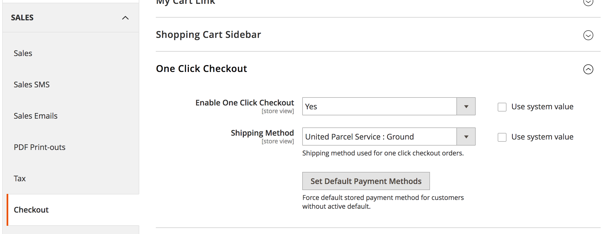

## Magento 2 One Click Checkout

Add one click checkout option for logged in customers.

#### Description
This module adds a button for "One Click Checkout" to the product view page for
customers meeting the following criteria:
* Customer MUST be logged in
* Customer MUST have default shipping and billing address
* Customer MUST have default vault payment method selected

Clicking the "One Click Checkout" button initiates and completes the transaction
on the product view page. Once complete, a modal displays a link to the order
view page and a summary of the order totals.

#### Configuration
Module settings are found in:  
`Stores->Configuration->Checkout->One Click Checkout`  
* **Enabled**: Enables/Disables One Click Checkout
* **Shipping Method**: The shipping method used for all One Click Checkout
orders
* **Set Default Payment Methods**: Sets the default payment method for all
customers without a default payment. The last stored payment method for is set
as default.

#### Compatibility
It is compatible with Braintree out of the box. Configuration can be added for
any payment method using the Magento Vault module for storing gateway tokens.

***Adding a new Vault Payment Provider***
1. Create class implementing `Pmclain\OneClickCheckout\Api\VaultSourceInterface`. The
returned array should include the vault method code and any additional
information required by the method's gateway request builders. The Braintree
source can be referenced as an example,
`Pmclain\OneClickCheckout\Model\VaultSource\Braintree`.
2. Add the new VaultSource to the VaultPool in di.xml  
```xml
<type name="Pmclain\OneClickCheckout\Model\VaultPool">
    <arguments>
        <argument name="vaultSourceMap" xsi:type="array">
            <item name="{{NON_VAULT_METHOD_CODE}}" xsi:type="object">{{VaultSourceClass}}</item>
        </argument>
    </arguments>
</type>
```
3. Update card renderer template via `Vendor/Module/view/frontend/layout/vault_cards_listaction.xml`
```xml
<referenceBlock name="{{RENDERER_BLOCK_NAME}}">
    <action method="setTemplate">
        <argument name="template" xsi:type="string">Pmclain_OneClickCheckout::customer_account/credit_card.phtml</argument>
    </action>
</referenceBlock>
```

### Magento Version Requirements
| Release | Magento Version |
| ------- | --------------- |
| 0.1.x   | 2.2.x           | 
| 0.1.x   | 2.1.x           |
| Nope    | 2.0.x           |

#### Screenshots
**Order Button**
  
  
**Order Confirmation**
 
   
**Order Placement Error**
  
  
**Customer Card Management**
  
  
**Admin Configuration**


#### License
GNU GENERAL PUBLIC LICENSE Version 3